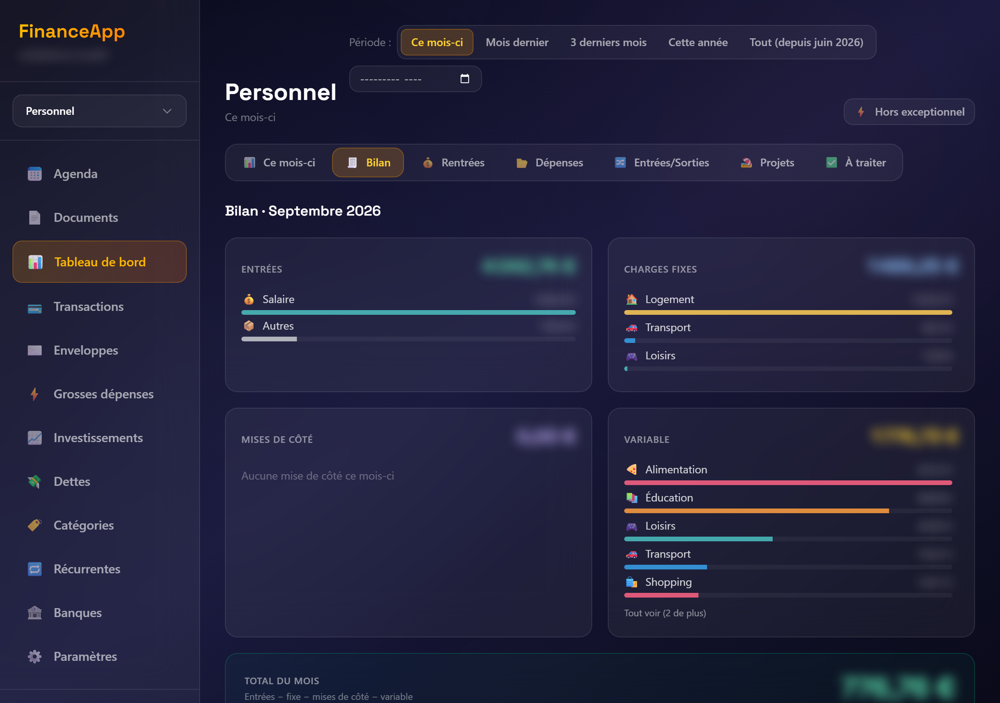
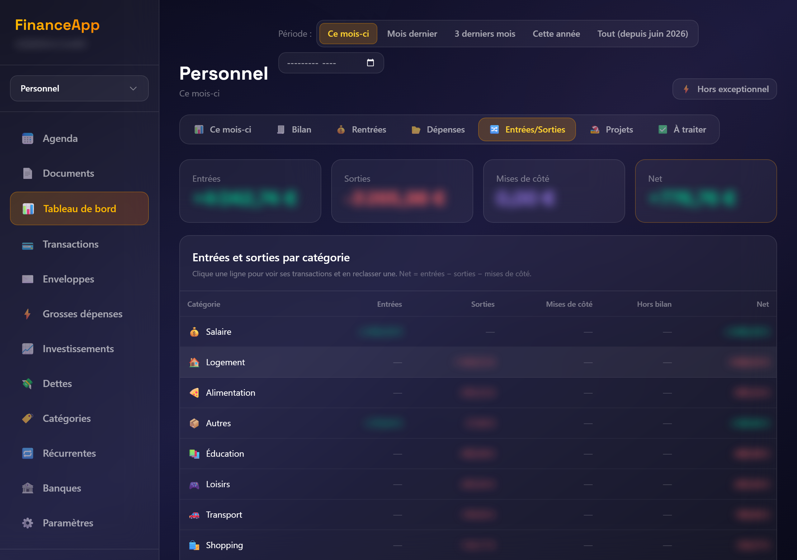
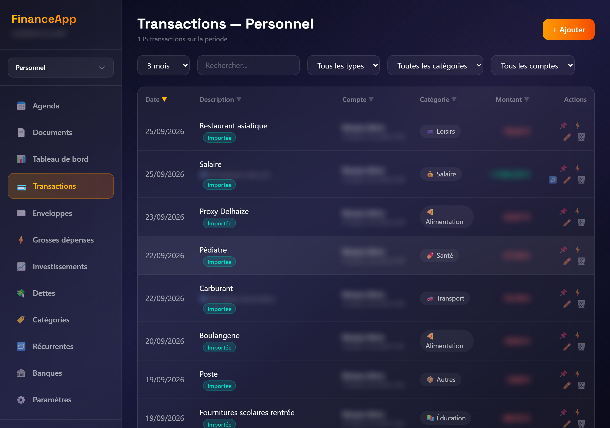
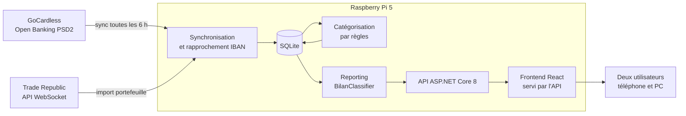

# Finance App

Gestion des finances d'un foyer : comptes bancaires synchronisés par Open Banking, portefeuille Trade Republic, bilan mensuel en blocs, enveloppes projets, prêts. Remplace le fichier Excel de suivi tenu à la main.


## En bref

Le foyer tenait ses comptes dans un classeur Excel, rempli à la main chaque mois. L'application récupère désormais les transactions des banques par l'API Open Banking, les catégorise par règles et produit le bilan que le classeur calculait. Elle tourne en production sur un Raspberry Pi 5 à la maison et sert au foyer au quotidien.

- 633 tests unitaires xunit (10 secondes), 17 scénarios de bout en bout Playwright
- 26 migrations de schéma depuis la baseline de juillet 2026, appliquées sur la base de production
- Un générateur de données de démonstration (`tools/SeedDemo`) qui refuse de s'exécuter sur la base de production

## Captures

Captures réalisées sur le ménage fictif généré par `tools/SeedDemo`, montants et noms floutés.







## Comment elle est construite

J'ai conçu l'application et je pilote son implémentation. Le code est produit par Claude Code, sous contrôle, lot par lot.

1. **Conception.** Chaque lot part d'une spécification et d'un plan écrits avant le code (`docs/superpowers/specs`, `docs/superpowers/plans`) : périmètre, modèle de données, cas limites, critères d'acceptation.
2. **Production.** L'IA écrit le code et les tests sur une branche dédiée, en suivant les règles du dépôt (`CLAUDE.md`).
3. **Vérification.** Build, tests unitaires, lint et build du frontend sont relancés de façon indépendante. Les écrans sont capturés à 390 px et 1280 px avant de déclarer un lot livré.
4. **Revue.** Une relecture critique du diff, classée par gravité, précède la fusion.
5. **Déploiement.** Sauvegarde de la base, migration appliquée service arrêté, bascule du binaire, contrôle après redémarrage.

Les arbitrages restent les miens : modèle de données, frontières entre services, ce qui entre dans un lot et ce qui en sort.

## Architecture



## Décisions d'architecture

- **Une seule fonction décide du bloc d'une transaction.** `BilanClassifier` range chaque ligne dans ENTRÉES, FIXE, MISES DE CÔTÉ, VARIABLE ou HORS BILAN, et toutes les vues en dérivent. Deux écrans ne peuvent pas afficher deux totaux différents pour le même mois.
- **Services purs d'un côté, services avec état de l'autre.** La logique métier (classement, projections, rendements) ne touche ni la base ni le réseau. Elle se teste sans fixture, d'où 633 tests en 10 secondes.
- **L'IBAN comme clé stable des comptes.** Une reconnexion Open Banking produit de nouveaux identifiants de compte. Le rapprochement par IBAN garde l'historique attaché au bon compte.
- **SQLite sur le Pi.** Un foyer, deux utilisateurs : un fichier suffit, et la sauvegarde avant migration se résume à une copie.
- **Pas de migration automatique au démarrage.** Le script SQL est généré, relu, puis appliqué service arrêté. Une migration ratée ne laisse pas l'application démarrer sur un schéma à moitié modifié.
- **Pas de rendement annualisé sans date d'entrée.** Un chiffre faux est pire qu'une case vide.

## Ce que l'app suppose

Elle est construite pour un foyer précis et ne prétend pas plus. Avant de l'installer ailleurs, savoir que :

- **Un couple, deux périmètres.** Un dashboard « Commun » partagé par invitation, et un dashboard personnel par utilisateur. Une transaction compte dans l'un ou l'autre selon le compte bancaire qui la porte et les règles de catégorisation (`PersoScopeRouter`).
- **Belgique par défaut.** La liste des banques GoCardless est filtrée sur `BE`, les règles de catégorisation livrées visent des enseignes belges, les montants s'affichent en euros et les dates en `fr-FR`.
- **Trade Republic est un cas particulier codé en dur.** Sa carte tire sur le compte joint, ses lignes portent un préfixe `tr-`, son portefeuille est réputé personnel. Sans compte Trade Republic, l'écran Investissements reste manuel.
- **Le bilan a une grille fixe.** ENTRÉES − FIXE − MISES DE CÔTÉ − VARIABLE = TOTAL, avec un HORS BILAN informatif. Une seule fonction décide du bloc d'une transaction (`BilanClassifier`), toutes les vues en dérivent.
- **Les catégories et les règles appartiennent à l'utilisateur, pas au dashboard.** Un membre invité voit les catégories par défaut et les siennes. C'est une limite connue du modèle multi-utilisateur.

## Fonctionnalités

- **Comptes** : connexion Open Banking (GoCardless, PSD2), synchronisation toutes les six heures, rapprochement des comptes par IBAN à la reconnexion, comptes manuels (livret), solde espèces Trade Republic
- **Transactions** : import et catégorisation par règles (mot-clé, contrepartie, IBAN), drapeaux fixe / exceptionnel / remboursement, rattachement à une enveloppe projet, trace des corrections manuelles
- **Bilan mensuel** en cinq blocs, résumé de période, reste à vivre jour par jour avec projection, historique par catégorie dans les deux sens avec comparatif N-1 borné par la couverture bancaire
- **Neutralisation des doubles comptages** : jambes de virements internes, alimentation de la carte courtier, balayage vers le livret
- **Investissements** : lignes manuelles ou import du portefeuille Trade Republic, valorisations empilées, prix de revient, plus-value latente, rendement annualisé (jamais sans date d'entrée), courbe du patrimoine reconstruite depuis la timeline
- **Prêts** : ancrage sur une ligne du tableau d'amortissement, capital restant dû recalculé
- **Enveloppes projets, objectifs d'épargne, budgets par catégorie, récurrentes avec provision du salaire**
- **Dashboards partagés** par invitation email, périmètre par compte logique
- **Sécurité** : JWT + refresh, confirmation d'email, BCrypt, rate limiting partitionné, contrôle d'appartenance sur chaque lecture, en-têtes de sécurité

## Stack

| Couche | Technologie |
|--------|-------------|
| Backend | C# / ASP.NET Core 8 Web API |
| ORM | Entity Framework Core 8 |
| BDD | SQLite (fichier) |
| Auth | JWT (BCrypt) |
| Banque | GoCardless Bank Account Data, API WebSocket Trade Republic |
| Frontend | React 19 + TypeScript + Vite |
| Style | Tailwind CSS 4 |
| Données | @tanstack/react-query, axios |
| Graphiques | Recharts |
| Tests | xunit (633 unitaires), Playwright (17 E2E) |

## Structure

```
finance-app/
├── backend/
│   ├── FinanceApp.API/
│   │   ├── Controllers/     # 16 contrôleurs sur ApiControllerBase + AuthController
│   │   ├── Models/          # 21 entités EF Core
│   │   ├── DTOs/            # Validation DataAnnotations
│   │   ├── Data/            # AppDbContext (config, index, seed)
│   │   ├── Migrations/      # 26 migrations depuis la baseline de juillet 2026
│   │   ├── Services/        # Métier : purs (testés sans base) et stateful (EF, HTTP)
│   │   │   └── Reporting/   # BilanClassifier, builders, ReportingService, AccountBalanceService
│   │   └── Program.cs
│   └── FinanceApp.Tests/    # xunit, fixtures Trade Republic en JSON
├── frontend/
│   └── src/
│       ├── api/             # Client Axios typé, un fichier par ressource
│       ├── components/      # Layout, dashboard/, investments/
│       ├── context/         # Auth, Dashboard, Period, Toast
│       ├── hooks/           # queries.ts (react-query) et hooks par domaine
│       ├── pages/           # 15 pages + 7 onglets dashboard/
│       ├── types/           # Interfaces miroir des DTO
│       └── utils/
├── tests/
│   └── e2e/                 # Playwright
├── tools/dev/               # Scripts de développement (confirmation d'emails en local)
└── docs/superpowers/        # Specs et plans des lots investissements
```

## Lancement

### Prérequis

- [.NET 8 SDK](https://dotnet.microsoft.com/download/dotnet/8.0)
- [Node.js](https://nodejs.org/) (v18+)
- Un `appsettings.Development.json` dans `backend/FinanceApp.API/` avec au moins `Jwt.Key` (l'app refuse de démarrer sans). GoCardless et SMTP sont optionnels en dev, les emails sont journalisés au lieu d'être envoyés.

### Backend

```bash
cd backend/FinanceApp.API
dotnet ef database update    # Crée finance.db, applique les migrations, seed des catégories
dotnet run                   # http://localhost:5000, Swagger sur /swagger
```

### Frontend

```bash
cd frontend
npm install
npm run dev                  # http://localhost:5173
```

### Tests

```bash
# Unitaires
cd backend && dotnet test FinanceApp.Tests/FinanceApp.Tests.csproj

# E2E (backend + frontend lancés)
cd tests && npm install && npx playwright install chromium && npm run test
```

Pour tester sans boîte mail, `dotnet script tools/dev/confirm-local-emails.csx` confirme tous les comptes de la base locale.

## Déploiement (Raspberry Pi)

L'app tourne en prod sur un Raspberry Pi 5 : `http://raspberrypi5:5001`. Le backend sert aussi le frontend (build Vite copié dans `wwwroot/`), même origine, URL d'API relative.

### Build sur le PC

```bash
cd frontend && npm run build

cd backend/FinanceApp.API
dotnet publish -c Release -r linux-arm64 --self-contained true -o <dossier-publish>
cp -r ../../frontend/dist <dossier-publish>/wwwroot
```

### Sur le Pi

- App : `/home/admin/finance-app/app/` (remplacée à chaque redéploiement)
- BDD : `/home/admin/finance-app/data/finance.db` (jamais touchée par un redéploiement, sauvegardée avant chaque migration)
- Secrets : `appsettings.Production.json` posé sur le Pi, hors git
- Service : systemd `finance-app` (`ASPNETCORE_ENVIRONMENT=Production`, `ASPNETCORE_URLS=http://0.0.0.0:5001`, restart auto)

Une migration s'applique **service arrêté**, par script SQL généré avec `dotnet ef migrations script`, avant de basculer le binaire.

## API

Swagger liste tout en Development. Les familles de routes :

| Préfixe | Rôle |
|---------|------|
| `/api/auth` | Inscription, confirmation, connexion, refresh |
| `/api/transaction` | CRUD, drapeaux, `summary`, `monthly-report`, `burndown`, `category-history`, `category-flow-history`, `account-balances`, `uncategorized`, `anomalies` |
| `/api/category`, `/api/categoryrules` | Catégories et règles de catégorisation (`seed-defaults`) |
| `/api/banking` | Institutions, connexion GoCardless et Trade Republic, comptes bancaires, synchronisation |
| `/api/investment` | Lignes, valorisations, import Trade Republic, historique du portefeuille |
| `/api/loans`, `/api/projectenvelope`, `/api/savings-goals`, `/api/budgets`, `/api/shoppingitem` | Passif, enveloppes, objectifs, budgets, à acheter |
| `/api/dashboards/{id}/recurring` | Récurrentes d'un dashboard, provision du salaire |
| `/api/dashboard`, `/api/invitation`, `/api/account` | Dashboards, membres, comptes logiques |

## Licence

Projet personnel.
